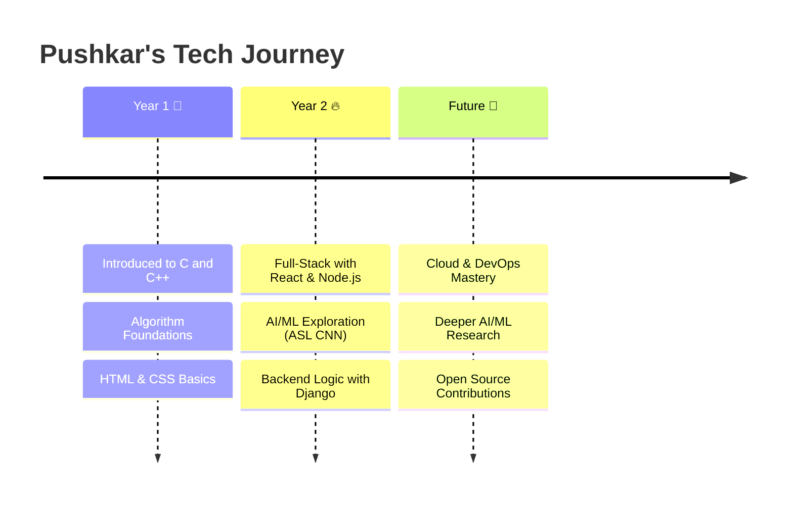

  
  
  
  

---

## 📍 Quick Navigation

- [🛠️ Tech Stack](#-tech-stack-breakdown)
- [🚀 Featured Projects](#-featured-projects)
- [📜 Certifications](#-certifications)
- [🗓️ My Journey](#-my-journey-so-far)
- [📊 GitHub Stats](#-github-stats)
- [📫 Connect With Me](#-lets-connect)

---

## 🛠️ Tech Stack Breakdown

  

| Category | Tools & Technologies |
| :--- | :--- |
| **Languages** |       |
| **Frontend** |  ![CSS3](https://img.shields.io/badge/CSS3-333333?style=for-the-badge&logo=data:image/svg%2Bxml;base64,PHN2ZyByb2xlPSJpbWciIHZpZXdCb3g9IjAgMCAyNCAyNCIgeG1sbnM9Imh0dHA6Ly93d3cudzMub3JnLzIwMDAvc3ZnIiBmaWxsPSJ3aGl0ZSI+PHRpdGxlPkNTUzwvdGl0bGU+PHBhdGggZD0iTTAgMHYyMC4xNkEzLjg0IDMuODQgMCAwIDAgMy44NCAyNGgxNi4zMkEzLjg0IDMuODQgMCAwIDAgMjQgMjAuMTZWMy44NEEzLjg0IDMuODQgMCAwIDAgMjAuMTYgMFptMTQuMjU2IDEzLjA4YzEuNTYgMCAyLjI4IDEuMDggMi4zMDQgMi42NGgtMS42MDhjLjAyNC0uMjg4LS4wNDgtLjYtLjE0NC0uODQtLjA5Ni0uMTkyLS4yODgtLjI2NC0uNTUyLS4yNjQtLjQ1NiAwLS42OTYuMjY0LS42OTYuODQtLjAyNC41NzYuMjg4Ljg4OC43NjggMS4wOC43Mi4yODggMS42MDguNzQ0IDEuOTIgMS4yOTZxLjQzMi42NDguNDMyIDEuNjU2YzAgMS42MDgtLjkxMiAyLjU5Mi0yLjQ5NiAyLjU5Mi0xLjY1NiAwLTIuNC0xLjAzMi0yLjQyNC0yLjY4OGgxLjY4YzAgLjc5Mi4yNjQgMS4xNzYuNzkyIDEuMTc2LjI2NCAwIC40NTYtLjA3Mi41NTItLjI0LjE5Mi0uMzEyLjI2NC0xLjE3Ni0uMDQ4LTEuNTEyLS4zMTItLjQwOC0uOTEyLS42LTEuMzItLjgxNnEtLjgyOC0uMzk2LTEuMjI0LS45MzZjLS4yNC0uMzYtLjM2LS44ODgtLjM2LTEuNTM2IDAtMS40NC45MzYtMi40NzIgMi40MjQtMi40NDhtNS40IDBjMS41ODQgMCAyLjMwNCAxLjA4IDIuMzI4IDIuNjRoLTEuNjA4YzAtLjI4OC0uMDQ4LS42LS4xNjgtLjg0LS4wOTYtLjE5Mi0uMjY0LS4yNjQtLjUyOC0uMjY0LS40OCAwLS43Mi4yNjQtLjcyLjg0cy4yODguODg4Ljc5MiAxLjA4Yy42OTYuMjg4IDEuNjA4Ljc0NCAxLjkyIDEuMjk2LjI2NC40MzIuNDA4Ljk4NC40MDggMS42NTYuMDI0IDEuNjA4LS44ODggMi41OTItMi40NzIgMi41OTItMS42OCAwLTIuNDI0LTEuMDU2LTIuNDQ4LTIuNjg4aDEuNjhjMCAuNzQ0LjI2NCAxLjE3Ni43OTIgMS4xNzYuMjY0IDAgLjQ1Ni0uMDcyLjU1Mi0uMjQuMjE2LS4zMTIuMjY0LTEuMTc2LS4wNDgtMS41MTItLjI4OC0uNDA4LS44ODgtLjYtMS4zMi0uODE2LS41NTItLjI2NC0uOTYtLjU3Ni0xLjItLjkzNnMtLjM2LS44ODgtLjM2LTEuNTM2Yy0uMDI0LTEuNDQuOTEyLTIuNDcyIDIuNC0yLjQ0OG0tMTEuMDMxLjAxOGMuNzExLS4wMDYgMS40MTkuMTk4IDEuODM5LjYzLjQzMi40MzIuNjcyIDEuMTI4LjY0OCAxLjk5Mkg5LjMzNmMuMDI0LS40NTYtLjA5Ni0uNzkyLS40MzItLjk2LS4zMTItLjE0NC0uNzY4LS4wNDgtLjg4OC4yNC0uMTIuMjY0LS4xOTIuNTc2LS4xNjguODY0djMuNTA0YzAgLjc0NC4yNjQgMS4xMjguNzY4IDEuMTI4YS42NS42NSAwIDAgMCAuNTUyLS4yNjRjLjE2OC0uMjQuMTkyLS41NTIuMTY4LS44NGgxLjc3NmMuMDk2IDEuNjMyLS45ODQgMi43MTItLTIuNTY4IDIuNjg4LTEuNTM2IDAtMi40OTYtLjg2NC0yLjQ3Mi0yLjQ3MnYtNC4wMzJjMC0uODE2LjI0LTEuNDQuNjk2LTEuODQ4LjQzMi0uNDA4IDEuMTQ2LS42MjQgMS44NTctLjYzIi8+PC9zdmc+)     |
| **Backend** |     |
| **AI / ML** |       |
| **DevOps** |     |
| **Database** |     |
| **Design** |   |

  

---

---

## 🚀 Featured Projects

| [ASL CNN](https://github.com/pushkar156/AmericanSignLanguageCNN) | [Morrigan](https://github.com/pushkar156/morrigan) |
| :---: | :---: |
|  |  |
| ⭐ ASL recognition using a custom C++ CNN. | ⭐ Modern backend patterns with TypeScript. |
|  |  |

---

## 📜 Certifications

  

    <table width="90%" align="center" style="border: none;">
      <tr>
        <td width="48%" align="right" valign="middle">
          
        </td>
        <td width="52%" align="left" valign="middle">Certified in modern web architectures and MERN stack.</td>
      </tr>
      <tr><td colspan="2" height="15"></td></tr>
      <tr>
        <td width="48%" align="right" valign="middle">
          
        </td>
        <td width="52%" align="left" valign="middle">Expertise in automated data analysis and backend systems.</td>
      </tr>
      <tr><td colspan="2" height="15"></td></tr>
      <tr>
        <td width="48%" align="right" valign="middle">
          
        </td>
        <td width="52%" align="left" valign="middle">Recognized proficiency in advanced C++ algorithms.</td>
      </tr>
    </table>
  

---

## 🗓️ My Journey So Far

  

    <h3>Milestones</h3>
    <table width="90%" align="center" style="border: none;">
      <tr>
        <td align="right" width="180px" valign="top"><b>Year 1 🌱</b></td>
        <td>Fell in love with problem-solving. Built first web pages. mastered C/C++ basics.</td>
      </tr>
      <tr><td colspan="2" height="10"></td></tr>
      <tr>
        <td align="right" width="180px" valign="top"><b>Year 2 🔥</b></td>
        <td>Diving into full-stack (React/Django). Launched ASL CNN project. Developing backend systems.</td>
      </tr>
      <tr><td colspan="2" height="10"></td></tr>
      <tr>
        <td align="right" width="180px" valign="top"><b>Future 🚀</b></td>
        <td>Shipping production-ready AI tools, mastering infrastructure, and contributing to global OS projects.</td>
      </tr>
    </table>
  

---

## 📫 Let's Connect

I'm always open to collaborating on exciting projects or just geeking out about tech!

---

## ✨ Fun Facts About Me

  

    <table width="90%" align="center">
      <tr>
        <td width="5%" align="right"></td>
        <td width="50%" align="left">Proudly from <b>Pune, India</b> — the tech capital of Maharashtra.</td>
      </tr>
      <tr><td colspan="2" height="10"></td></tr>
      <tr>
        <td width="5%" align="right"></td>
        <td width="50%" align="left"><b>Remote Dev</b> — home is where the high-speed fiber is.</td>
      </tr>
      <tr><td colspan="2" height="10"></td></tr>
      <tr>
        <td width="5%" align="right"></td>
        <td width="50%" align="left">Active <b>CS Student</b> — already building real-world software.</td>
      </tr>
    </table>
  

---

## 📊 GitHub Stats

  

---

  <!-- Snake Animation -->
  <picture>
    <source media="(prefers-color-scheme: dark)" srcset="https://raw.githubusercontent.com/pushkar156/pushkar156/output/github-contribution-grid-snake-dark.svg">
    <source media="(prefers-color-scheme: light)" srcset="https://raw.githubusercontent.com/pushkar156/pushkar156/output/github-contribution-grid-snake.svg">
    
  </picture>

---

  

---

  

