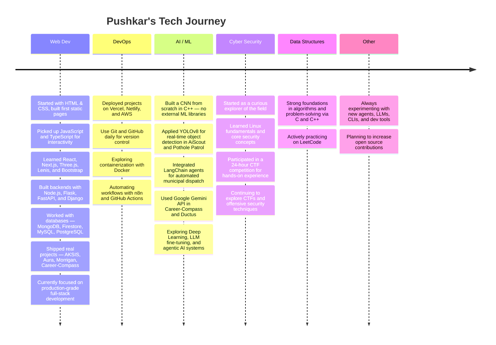

  

    

  
  
  

  
  
  
  

---

## 📍 Quick Navigation

- [🛠️ Tech Stack](#tech-stack)
- [🚀 Featured Projects](#featured-projects)
- [🗓️ My Journey](#my-journey)
- [📫 Connect With Me](#connect)
- [✨ Fun Facts](#fun-facts)
- [📊 GitHub Stats](#stats)

---

## 🛠️ Tech Stack Breakdown

  

| Category | Tools & Technologies |
| :--- | :--- |
| **Languages** |       |
| **Frontend** |         |
| **Backend** |       |
| **AI / ML** |           |
| **DevOps** |        |
| **Database** |      |
| **Design** |   |

  

---

## 🚀 Featured Projects

### 🟢 Completed &nbsp;&nbsp; 🟡 Working On It &nbsp;&nbsp; 🔴 Needs Improvement

<table>

<!-- Row 1 -->
<tr>
<td align="center" width="33%">

**[🗺️ Campus-Route](https://github.com/pushkar156/Campus-Route)**

Smart campus navigation for MIT-WPU using graph algorithms.

  

</td>
<td align="center" width="33%">

**[📦 OptiTrack-CLI](https://github.com/pushkar156/OptiTrack-CLI)**

High-performance OOP inventory system with role-based access.

 

</td>
<td align="center" width="33%">

**[🖥️ OptiTrack-GUI](https://github.com/pushkar156/OptiTrack-GUI)**

GUI version of OptiTrack — currently under construction.

</td>
</tr>

<!-- Row 2 -->
<tr>
<td align="center" width="33%">

**[🛣️ Pothole Patrol](https://github.com/pushkar156/Pothole_Patrol)**

AI-powered crowdsourced road damage detection & auto-dispatch.

  

</td>
<td align="center" width="33%">

**[🌐 morrigan](https://github.com/pushkar156/morrigan)**

Web app with chatbot backend — active team collaboration.

  

</td>
<td align="center" width="33%">

**[🔀 Ductus](https://github.com/pushkar156/Ductus)**

AI-powered flowchart generator using Google Gemini.

 

</td>
</tr>

<!-- Row 3 -->
<tr>
<td align="center" width="33%">

**[📸 PhotoNarrator](https://github.com/pushkar156/PhotoNarrator)**

Photo storytelling web app with AI captions & Firebase backend.

  

</td>
<td align="center" width="33%">

**[🍽️ Aura](https://github.com/pushkar156/Aura)**

Mobile-first restaurant menu app with 80+ items & dark mode.

  

</td>
<td align="center" width="33%">

**[🧭 Career-Compass](https://github.com/pushkar156/Career-Compass)**

AI career counselor with personalized roadmaps & Gemini AI.

  

</td>
</tr>

<!-- Row 4 -->
<tr>
<td align="center" width="33%">

**[⚽ AiScout](https://github.com/pushkar156/AiScout)**

Football player performance analysis with CV & Streamlit dashboard.

  

</td>
<td align="center" width="33%">

**[🤟 AmericanSignLanguageCNN](https://github.com/pushkar156/AmericanSignLanguageCNN)**

CNN built from scratch in C++ for ASL gesture recognition — ~88.5% accuracy.

  

</td>
<td align="center" width="33%">
<!-- Empty — reserved for next project -->
</td>
</tr>

</table>

 ---
 

## 🗓️ My Journey So Far

  

    <h3>Milestones</h3>
    <table width="90%" align="center" style="border: none;">
      <tr>
        <td align="right" width="180px" valign="top"><b>Past 🌱</b></td>
        <td>Fell in love with problem-solving through C and C++. Built first web pages. Explored algorithms, data structures, and core CS fundamentals. Started experimenting with ML by building a CNN from scratch.</td>
      </tr>
      <tr><td colspan="2" height="10"></td></tr>
      <tr>
        <td align="right" width="180px" valign="top"><b>Present 🔥</b></td>
        <td>Actively building full-stack and AI-powered projects — from YOLOv8 computer vision pipelines and LangChain agents to Next.js web apps. Shipping real products, collaborating with teams, and deepening backend and DevOps knowledge.</td>
      </tr>
      <tr><td colspan="2" height="10"></td></tr>
      <tr>
        <td align="right" width="180px" valign="top"><b>Future 🚀</b></td>
        <td>Shipping production-ready AI tools, mastering cloud infrastructure, contributing to open source, and going deeper into LLMs, agentic systems, and cybersecurity.</td>
      </tr>
    </table>
  

---

## 📫 Let's Connect

I'm always open to collaborating on exciting projects or just geeking out about tech!

---

## ✨ Fun Facts About Me

  

    <table width="90%" align="center">
      <tr>
        <td width="5%" align="right"></td>
        <td width="50%" align="left">Proudly from <b>Pune, India</b> — the tech capital of Maharashtra.</td>
      </tr>
      <tr><td colspan="2" height="10"></td></tr>
      <tr>
        <td width="5%" align="right"></td>
        <td width="50%" align="left"><b>Remote Dev</b> — home is where the high-speed fiber is.</td>
      </tr>
      <tr><td colspan="2" height="10"></td></tr>
      <tr>
        <td width="5%" align="right"></td>
        <td width="50%" align="left">Active <b>CS Student</b> — already building real-world software.</td>
      </tr>
    </table>
  

---

## 📊 GitHub Stats

  

---

  <!-- Snake Animation -->
  <picture>
    <source media="(prefers-color-scheme: dark)" srcset="https://raw.githubusercontent.com/pushkar156/pushkar156/output/github-contribution-grid-snake-dark.svg">
    <source media="(prefers-color-scheme: light)" srcset="https://raw.githubusercontent.com/pushkar156/pushkar156/output/github-contribution-grid-snake.svg">
    
  </picture>

---

  

---

  

